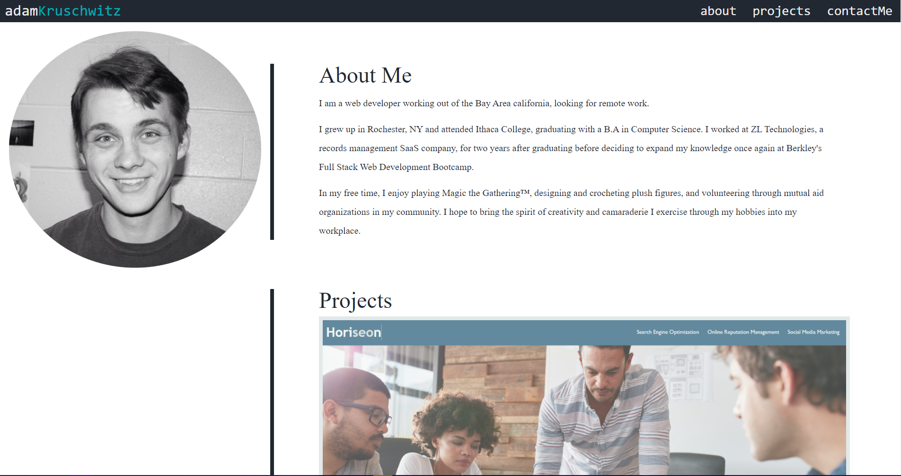

# Portfolio
A portfolio of my professional work to date. This site was created using only HTML and CSS for a homework in the Berkley Full Stack Development Bootcamp.

## Links
- [Deployed site](https://adamkruschwitz.github.io/Portfolio/)
- [GitHub](https://github.com/AdamKruschwitz/Portfolio)
- [My Linkedin](https://www.linkedin.com/in/adamkruschwitz/)
- [My Email](mailto:a.j.kruschwitz@gmail.com) for business inquiries only

## Work Done
This website was developed entirely from scratch using HTLM and CSS. Initial sketches were done by hand. This site was built for desktop first, with mobile functionality included afterwards.

## Screenshot

